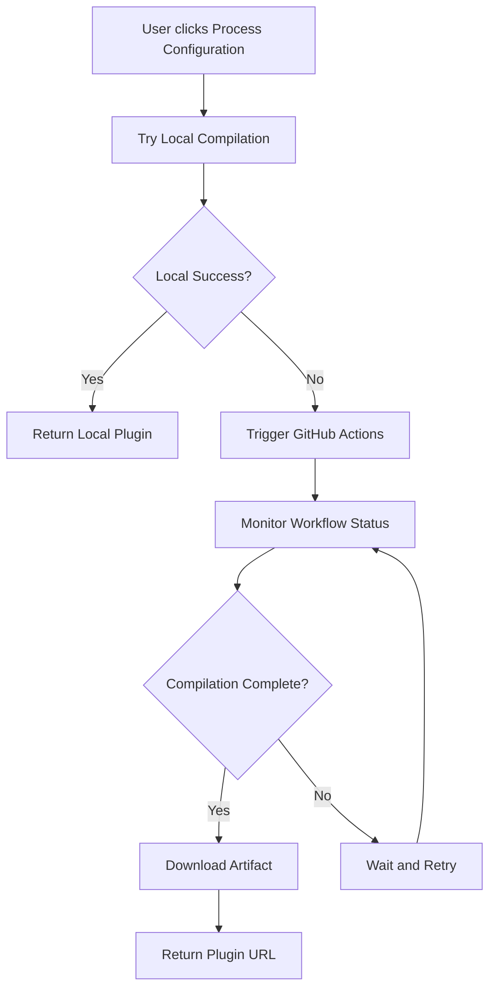

# GitHub Actions Compilation Setup

This document explains how to set up GitHub Actions as a fallback compilation service for Next Agentify when local Go compilation fails in serverless environments like Netlify.

## Overview

When the local Go compiler isn't available (e.g., in Netlify's serverless environment), the application automatically falls back to using GitHub Actions to compile agent plugins. This provides a reliable compilation service using GitHub's infrastructure.

## Setup Steps

### 1. GitHub Token Configuration

1. Go to GitHub Settings → Developer settings → Personal access tokens → Tokens (classic)
2. Generate a new token with the following permissions:
   - `repo` (Full control of private repositories)
   - `actions` (Read and write access to actions)
   - `workflow` (Update GitHub Action workflows)

3. Add the token to your Netlify environment variables:
   ```
   GITHUB_TOKEN=your_github_token_here
   ```

### 2. Repository Configuration

Add these environment variables to Netlify:

```bash
# GitHub Actions Configuration
GITHUB_TOKEN=your_github_token_here
GITHUB_OWNER=guiperry
GITHUB_REPO=next-agentify
GITHUB_WORKFLOW_ID=compile-plugin.yml
```

### 3. Workflow File

The GitHub Actions workflow is located at `.github/workflows/compile-plugin.yml`. It:

- Sets up Go 1.21 and Python 3.11
- Installs build dependencies
- Generates Go and Python code from templates
- Compiles to WASM or Go plugin format
- Uploads artifacts for download

### 4. Supabase Schema

Run the SQL in `docs/supabase-schema.sql` to create the necessary tables:

- `compilation_requests` - Tracks compilation jobs
- `agent_configs` - Stores agent configurations
- `compiled_plugins` - Stores compiled plugin metadata

## How It Works

### 1. Compilation Flow



### 2. API Endpoints

- `POST /api/compile` - Main compilation endpoint with fallback logic
- `GET /api/compile/status?jobId=xxx` - Check GitHub Actions job status
- `POST /api/compile/status` - Wait for job completion

### 3. SSE Updates

Real-time compilation updates are sent via Server-Sent Events:

```javascript
// Frontend receives updates like:
{
  type: 'compilation_update',
  data: {
    step: 'compilation',
    progress: 70,
    message: 'Triggering GitHub Actions compilation...',
    status: 'in_progress'
  }
}
```

## Workflow Inputs

The GitHub Actions workflow accepts these inputs:

- `job_id` - Unique identifier for the compilation job
- `config` - JSON string containing agent configuration
- `build_target` - Either 'wasm' or 'go'
- `platform` - Target platform (linux, darwin, windows)

## Artifacts

Compiled plugins are uploaded as GitHub Actions artifacts with:

- 7-day retention period
- Unique naming: `agent-plugin-{job_id}`
- Contains compiled binary, Python service, and configuration

## Error Handling

The system handles various failure scenarios:

1. **Local compilation fails** → Automatic fallback to GitHub Actions
2. **GitHub Actions unavailable** → Clear error message
3. **Workflow timeout** → 5-minute timeout with status updates
4. **Artifact download fails** → Retry logic with error reporting

## Monitoring

You can monitor compilation jobs through:

1. **Netlify Functions logs** - Server-side compilation attempts
2. **GitHub Actions tab** - Workflow execution details
3. **Browser DevTools** - SSE messages and API responses
4. **Supabase dashboard** - Compilation request records

## Security Considerations

- GitHub token has minimal required permissions
- Artifacts are automatically cleaned up after 7 days
- User authentication required for all compilation requests
- Row-level security enforced in Supabase

## Troubleshooting

### Common Issues

1. **"GitHub Actions compilation unavailable"**
   - Check GITHUB_TOKEN environment variable
   - Verify token permissions
   - Ensure repository access

2. **"Workflow run not found"**
   - Check workflow file exists in `.github/workflows/`
   - Verify GITHUB_WORKFLOW_ID matches filename
   - Ensure workflow is enabled in repository settings

3. **"Compilation timeout"**
   - Check GitHub Actions quota/limits
   - Review workflow logs for build errors
   - Verify Go/Python setup steps

### Debug Steps

1. Check Netlify function logs for compilation attempts
2. Review GitHub Actions workflow runs
3. Verify environment variables in Netlify dashboard
4. Test GitHub API connectivity with token

## Cost Considerations

- GitHub Actions provides 2,000 free minutes per month for private repos
- Each compilation typically takes 2-5 minutes
- Artifacts storage is free for 7 days
- Consider upgrading GitHub plan for heavy usage

## Future Improvements

- Implement compilation result caching
- Add support for custom build configurations
- Integrate with other CI/CD providers as additional fallbacks
- Add compilation analytics and usage tracking
